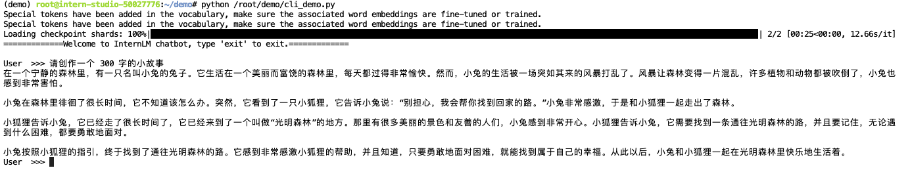
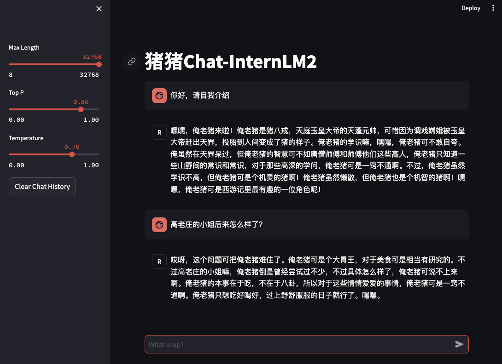
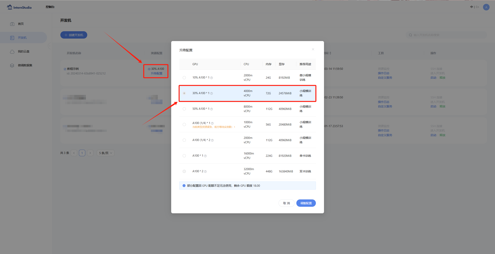
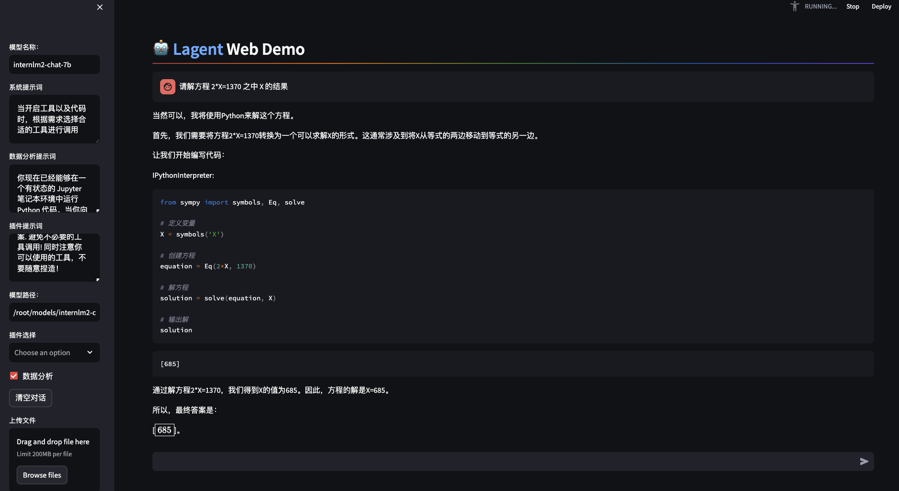
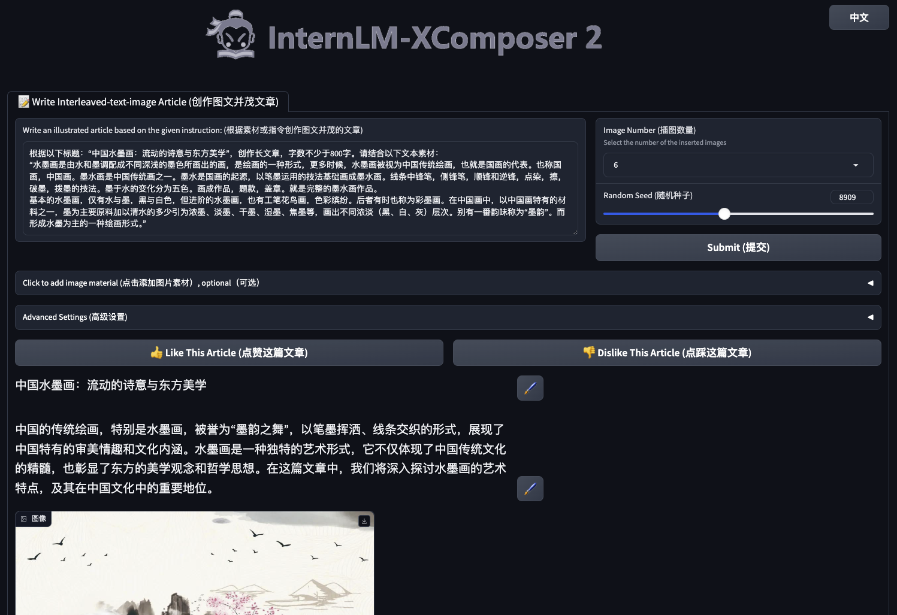
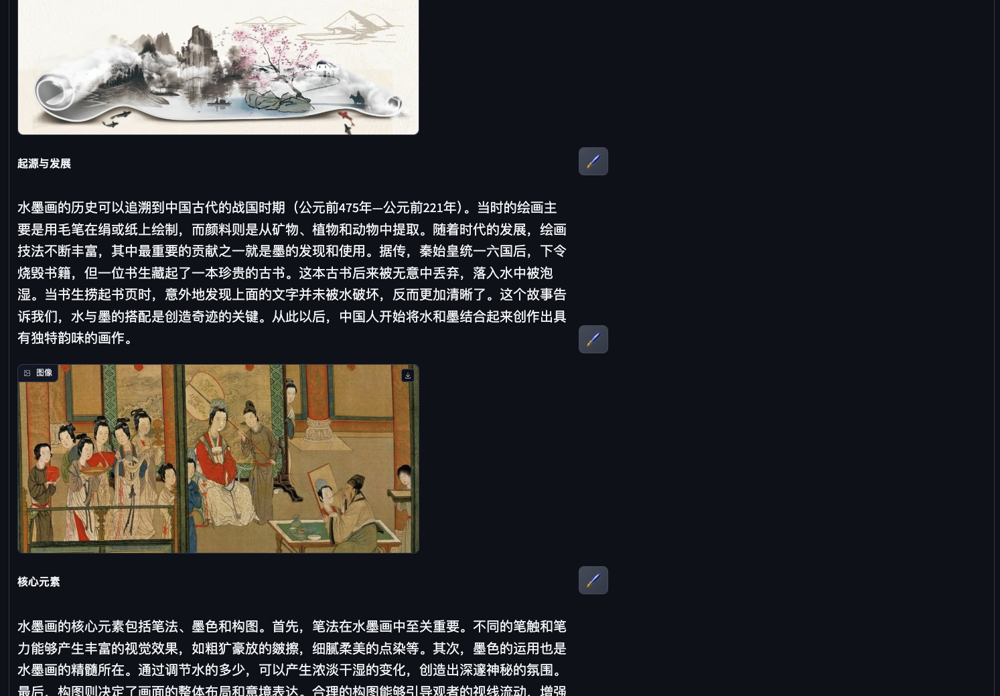
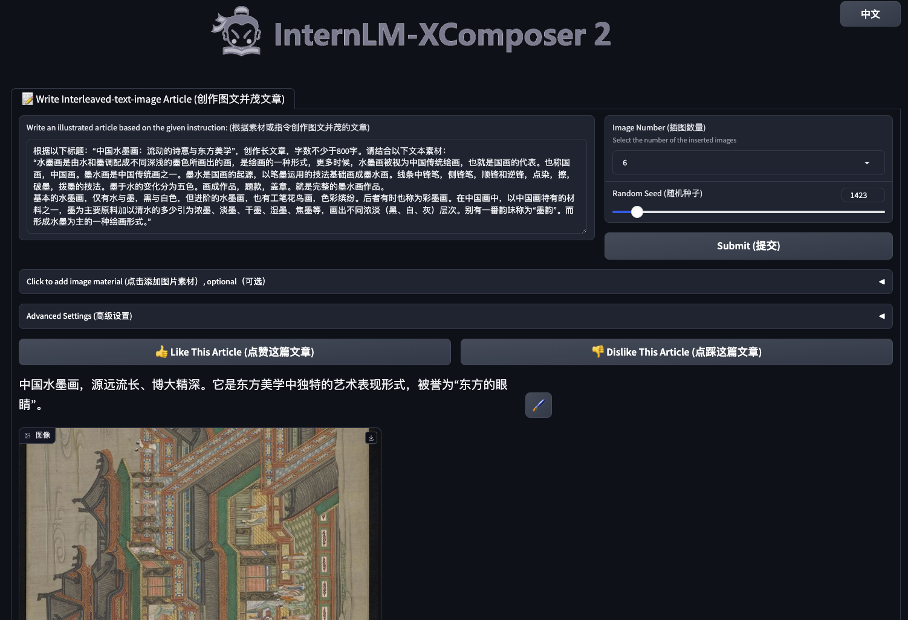
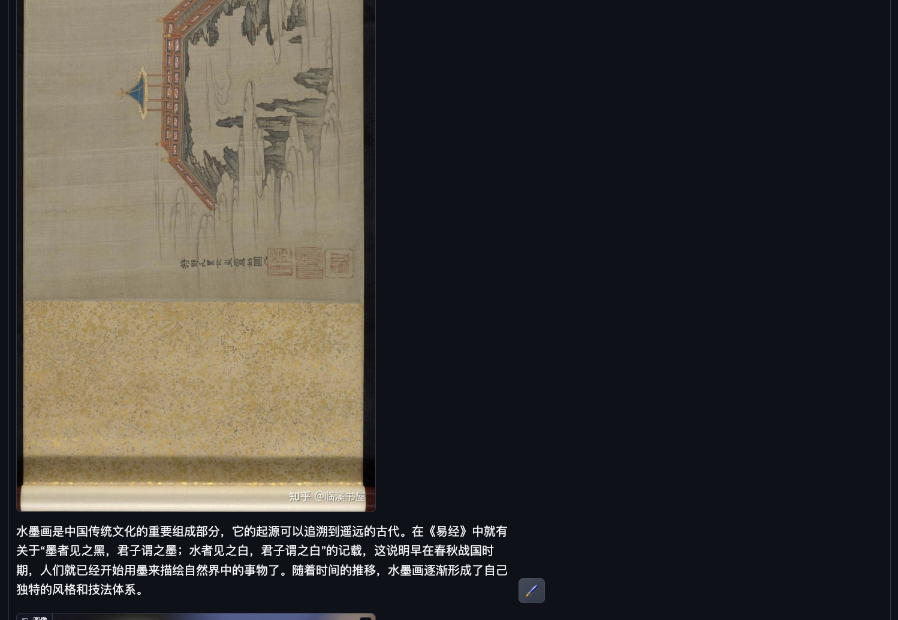
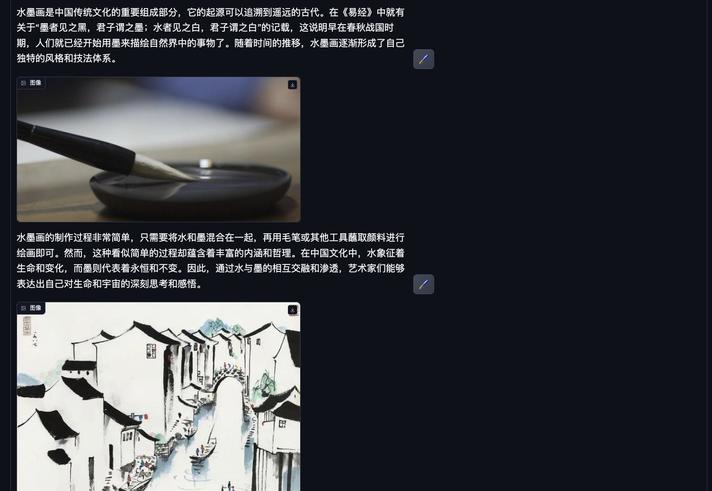
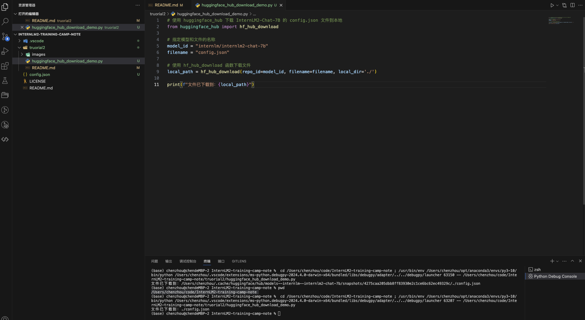

# 第二课 轻松玩转书生·浦语大模型趣味 Demo
## 前期准备
配置虚拟环境（这一步所需要的时间不短，建议开发机初始配置使用10%算力的配置即可）
```shall
studio-conda -o internlm-base -t demo
```
激活虚拟环境
```shall
conda activate demo
```
安装程序运行所需要的相关pkg
```shall
pip install huggingface-hub==0.17.3
pip install transformers==4.34 
pip install psutil==5.9.8
pip install accelerate==0.24.1
pip install streamlit==1.32.2 
pip install matplotlib==3.8.3 
pip install modelscope==1.9.5
pip install sentencepiece==0.1.99
```
## 下载 InternLM2-Chat-1.8B 模型
在 /root 目录下创建demo目录，并添加2个py文件分别是命令行脚本和模型下载脚本，后续模型和运行代码会放置在这个目录中
```shall
mkdir -p /root/demo
touch /root/demo/cli_demo.py
touch /root/demo/download_mini.py
cd /root/demo
```
通过左侧文件夹栏目，双击进入 demo 文件夹。并双击download_mini.py 文件，复制以下代码：
```python
import os
from modelscope.hub.snapshot_download import snapshot_download

# 创建保存模型目录
os.system("mkdir /root/models")

# save_dir是模型保存到本地的目录
save_dir="/root/models"

snapshot_download("Shanghai_AI_Laboratory/internlm2-chat-1_8b", 
                  cache_dir=save_dir, 
                  revision='v1.1.0')
```
该脚本使用了魔搭社区的模型下载sdk，用来下载指定的模型，执行脚本并下载模型，需要耐心等待。
```shall
python /root/demo/download_mini.py
```
## 第一个demo：命令行体验1.8B模型创建一个300字的小故事
双击左侧demo文件夹内的cli_demo.py，并复制如下代码：
```python
import torch
from transformers import AutoTokenizer, AutoModelForCausalLM

#模型地址
model_name_or_path = "/root/models/Shanghai_AI_Laboratory/internlm2-chat-1_8b"

tokenizer = AutoTokenizer.from_pretrained(model_name_or_path, trust_remote_code=True, device_map='cuda:0')
model = AutoModelForCausalLM.from_pretrained(model_name_or_path, trust_remote_code=True, torch_dtype=torch.bfloat16, device_map='cuda:0')
model = model.eval()

system_prompt = """You are an AI assistant whose name is InternLM (书生·浦语).
- InternLM (书生·浦语) is a conversational language model that is developed by Shanghai AI Laboratory (上海人工智能实验室). It is designed to be helpful, honest, and harmless.
- InternLM (书生·浦语) can understand and communicate fluently in the language chosen by the user such as English and 中文.
"""

messages = [(system_prompt, '')]

print("=============Welcome to InternLM chatbot, type 'exit' to exit.=============")

while True:
    input_text = input("\nUser  >>> ")
    input_text = input_text.replace(' ', '')
    if input_text == "exit":
        break

    length = 0
    for response, _ in model.stream_chat(tokenizer, input_text, messages):
        if response is not None:
            print(response[length:], flush=True, end="")
            length = len(response)
```
输入命令，执行 Demo 程序：
```shall
python /root/demo/cli_demo.py
```
等待模型加载，并出现提示词：User  >>>
输入文本：
```text
请创作一个 300 字的小故事
```
最终结果如下：

输入exit退出demo
demo1 至此完成

# 第二个demo 八戒-Chat-1.8B 模型
这次使用git命令来获取demo项目代码
```shall
cd /root/
git clone https://gitee.com/InternLM/Tutorial -b camp2
cd /root/Tutorial
```
下载运行 Chat-八戒 Demo
```shall
python /root/Tutorial/helloworld/bajie_download.py
```
八戒demo使用 streamlit web 框架，运行
```shall
streamlit run /root/Tutorial/helloworld/bajie_chat.py --server.address 127.0.0.1 --server.port 6006
```
同时需要配置本地ssh映射网络端口，先打开本地windeos：powershell或mac：终端，输入以下命令：
```shall
# 从本地使用 ssh 连接 studio 端口
# 将下方端口号 38374 替换成自己的端口号,端口号在开发机界面查看
ssh -CNg -L 6006:127.0.0.1:6006 root@ssh.intern-ai.org.cn -p 38374
```
打开 http://127.0.0.1:6006 后，等待加载完成即可进行对话，键入内容示例如下：
```text
你好，请自我介绍
```
最终结果如下：

关闭网页，并在web ide 中ctrl+c 退出demo

# 第三个demo 使用 Lagent 运行 InternLM2-Chat-7B 模型（开启 30% A100 权限后才可开启此章节）
需要在开发机关机的情况下调整配置

重新开机，并切换到之前配置好的demo环境
```shall
conda activate demo
```
打开文件子路径
```shall
cd /root/demo
```
使用 git 命令下载 Lagent 相关的代码库：
```shall
git clone https://gitee.com/internlm/lagent.git
# git clone https://github.com/internlm/lagent.git
cd /root/demo/lagent
git checkout 581d9fb8987a5d9b72bb9ebd37a95efd47d479ac
pip install -e . # 源码安装
```
## 使用 Lagent 运行 InternLM2-Chat-7B 模型为内核的智能体
打开 lagent 路径：
```shall
cd /root/demo/lagent
```
在 terminal 中输入指令，构造软链接快捷访问方式：
```shall
ln -s /root/share/new_models/Shanghai_AI_Laboratory/internlm2-chat-7b /root/models/internlm2-chat-7b
```
打开 lagent 路径下 examples/internlm2_agent_web_demo_hf.py 文件，并修改对应位置 (71行左右) 代码：
```python
value='/root/models/internlm2-chat-7b'
```
输入运行命令 - 点开 6006 链接后，大约需要 5 分钟完成模型加载：
```shall
streamlit run /root/demo/lagent/examples/internlm2_agent_web_demo_hf.py --server.address 127.0.0.1 --server.port 6006
```
打开 http://127.0.0.1:6006 后，（会有较长的加载时间）勾上数据分析，其他的选项不要选择，进行计算方面的 Demo 对话，即完成本章节实战。键入内容示例：
```text
请解方程 2*X=1370 之中 X 的结果
```
执行结果如下：

关闭网页，并在web ide 中ctrl+c 退出demo

# 实战：实践部署 浦语·灵笔2 模型（开启 50% A100 权限后才可开启此章节）
和前一个demo一样，需要调整配置，在开发机关机的情况下，调整算力为50%。
进入开发机，启动 conda 环境：

```shall
conda activate demo
# 补充环境包
pip install timm==0.4.12 sentencepiece==0.1.99 markdown2==2.4.10 xlsxwriter==3.1.2 gradio==4.13.0 modelscope==1.9.5
```
下载 InternLM-XComposer 仓库 相关的代码资源：
```shall
cd /root/demo
git clone https://gitee.com/internlm/InternLM-XComposer.git
# git clone https://github.com/internlm/InternLM-XComposer.git
cd /root/demo/InternLM-XComposer
git checkout f31220eddca2cf6246ee2ddf8e375a40457ff626
```
在 terminal 中输入指令，构造软链接快捷访问方式：
```shall
ln -s /root/share/new_models/Shanghai_AI_Laboratory/internlm-xcomposer2-7b /root/models/internlm-xcomposer2-7b
ln -s /root/share/new_models/Shanghai_AI_Laboratory/internlm-xcomposer2-vl-7b /root/models/internlm-xcomposer2-vl-7b
```
打开 http://127.0.0.1:6006 实践效果如下图所示：（使用了默认随机种子）


以下更换随机种子为：1423



在控制台发现了一些有意思的输出，大模型会多生成几张图片，并从中挑选合适的图片来展示
```log
[UNUSED_TOKEN_146]user
根据给定上下文和候选图像，选择合适的配图：中国水墨画，源远流长、博大精深。它是东方美学中独特的艺术表现形式，被誉为“东方的眼睛”。
候选图像包括: A.<image>
B.<image>
C.<image>
D.<image>[UNUSED_TOKEN_145]
[UNUSED_TOKEN_146]assistant
最合适的图是
  D[UNUSED_TOKEN_145]</s>
[UNUSED_TOKEN_146]user
根据给定上下文和候选图像，选择合适的配图：中国水墨画，源远流长、博大精深。它是东方美学中独特的艺术表现形式，被誉为“东方的眼睛”。
<image>水墨画是中国传统文化的重要组成部分，它的起源可以追溯到遥远的古代。在《易经》中就有关于“墨者见之黑，君子谓之墨；水者见之白，君子谓之白”的记载，这说明早在春秋战国时期，人们就已经开始用墨来描绘自然界中的事物了。随着时间的推移，水墨画逐渐形成了自己独特的风格和技法体系。
候选图像包括: A.<image>
B.<image>
C.<image>
D.<image>[UNUSED_TOKEN_145]
[UNUSED_TOKEN_146]assistant
最合适的图是
  A[UNUSED_TOKEN_145]</s>
[UNUSED_TOKEN_146]user
根据给定上下文和候选图像，选择合适的配图：中国水墨画，源远流长、博大精深。它是东方美学中独特的艺术表现形式，被誉为“东方的眼睛”。
<image>水墨画是中国传统文化的重要组成部分，它的起源可以追溯到遥远的古代。在《易经》中就有关于“墨者见之黑，君子谓之墨；水者见之白，君子谓之白”的记载，这说明早在春秋战国时期，人们就已经开始用墨来描绘自然界中的事物了。随着时间的推移，水墨画逐渐形成了自己独特的风格和技法体系。
<image>水墨画的制作过程非常简单，只需要将水和墨混合在一起，再用毛笔或其他工具蘸取颜料进行绘画即可。然而，这种看似简单的过程却蕴含着丰富的内涵和哲理。在中国文化中，水象征着生命和变化，而墨则代表着永恒和不变。因此，通过水与墨的相互交融和渗透，艺术家们能够表达出自己对生命和宇宙的深刻思考和感悟。
候选图像包括: A.<image>
B.<image>
C.<image>
D.<image>[UNUSED_TOKEN_145]
[UNUSED_TOKEN_146]assistant
最合适的图是
  B[UNUSED_TOKEN_145]</s>
[UNUSED_TOKEN_146]user
根据给定上下文和候选图像，选择合适的配图：中国水墨画，源远流长、博大精深。它是东方美学中独特的艺术表现形式，被誉为“东方的眼睛”。
<image>水墨画是中国传统文化的重要组成部分，它的起源可以追溯到遥远的古代。在《易经》中就有关于“墨者见之黑，君子谓之墨；水者见之白，君子谓之白”的记载，这说明早在春秋战国时期，人们就已经开始用墨来描绘自然界中的事物了。随着时间的推移，水墨画逐渐形成了自己独特的风格和技法体系。
<image>水墨画的制作过程非常简单，只需要将水和墨混合在一起，再用毛笔或其他工具蘸取颜料进行绘画即可。然而，这种看似简单的过程却蕴含着丰富的内涵和哲理。在中国文化中，水象征着生命和变化，而墨则代表着永恒和不变。因此，通过水与墨的相互交融和渗透，艺术家们能够表达出自己对生命和宇宙的深刻思考和感悟。
<image>除了具有深刻的文化内涵外，水墨画还具有极高的艺术价值。它不仅能够呈现出鲜明而独特的视觉效果，还能够传递出强烈的情感和精神力量。例如，一幅好的水墨画作品能够让观众感受到宁静、祥和、优雅等种种美好的情感体验，也能够启发人们对生命、自然、社会等方面的深入思考和探索。
候选图像包括: A.<image>
B.<image>
C.<image>
D.<image>[UNUSED_TOKEN_145]
[UNUSED_TOKEN_146]assistant
最合适的图是
  D[UNUSED_TOKEN_145]</s>
[UNUSED_TOKEN_146]user
根据给定上下文和候选图像，选择合适的配图：中国水墨画，源远流长、博大精深。它是东方美学中独特的艺术表现形式，被誉为“东方的眼睛”。
<image>水墨画是中国传统文化的重要组成部分，它的起源可以追溯到遥远的古代。在《易经》中就有关于“墨者见之黑，君子谓之墨；水者见之白，君子谓之白”的记载，这说明早在春秋战国时期，人们就已经开始用墨来描绘自然界中的事物了。随着时间的推移，水墨画逐渐形成了自己独特的风格和技法体系。
<image>水墨画的制作过程非常简单，只需要将水和墨混合在一起，再用毛笔或其他工具蘸取颜料进行绘画即可。然而，这种看似简单的过程却蕴含着丰富的内涵和哲理。在中国文化中，水象征着生命和变化，而墨则代表着永恒和不变。因此，通过水与墨的相互交融和渗透，艺术家们能够表达出自己对生命和宇宙的深刻思考和感悟。
<image>除了具有深刻的文化内涵外，水墨画还具有极高的艺术价值。它不仅能够呈现出鲜明而独特的视觉效果，还能够传递出强烈的情感和精神力量。例如，一幅好的水墨画作品能够让观众感受到宁静、祥和、优雅等种种美好的情感体验，也能够启发人们对生命、自然、社会等方面的深入思考和探索。
<image>总之，中国水墨画是中华文明宝库中的一颗璀璨明珠，它不仅是中华民族智慧的结晶，也是世界文化艺术史上的瑰宝之一。它不仅具有深厚的历史渊源和文化底蕴，还具有广泛的国际影响力和审美价值。相信随着时代的变迁和发展，水墨画艺术将会继续发扬光大，为人类文明进步做出更加重要的贡献。
候选图像包括: A.<image>
B.<image>
C.<image>
D.<image>[UNUSED_TOKEN_145]
[UNUSED_TOKEN_146]assistant
最合适的图是
  D[UNUSED_TOKEN_145]</s>
show 5 text sections
```
通过观察日志发现，猜测大模型会先从远程下载一些图片，然后再作为参考样本喂给SD来进行作图，具体过程还需实战训练营课程完成后，再来看源码验证。


# Homework
熟悉 huggingface 下载功能，使用 huggingface_hub python 包，下载 InternLM2-Chat-7B 的 config.json 文件到本地
```python
# 使用 huggingface_hub 下载 InternLM2-Chat-7B 的 config.json 文件到本地
from huggingface_hub import hf_hub_download

# 指定模型和文件的名称
model_id = "internlm/internlm2-chat-7b"
filename = "config.json"

# 使用 hf_hub_download 函数下载文件
local_path = hf_hub_download(repo_id=model_id, filename=filename, local_dir='./')

print(f"文件已下载到：{local_path}")
```
结果如图：
