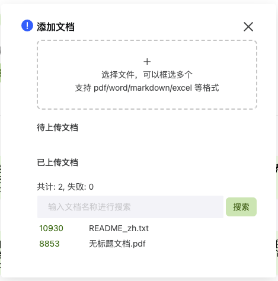
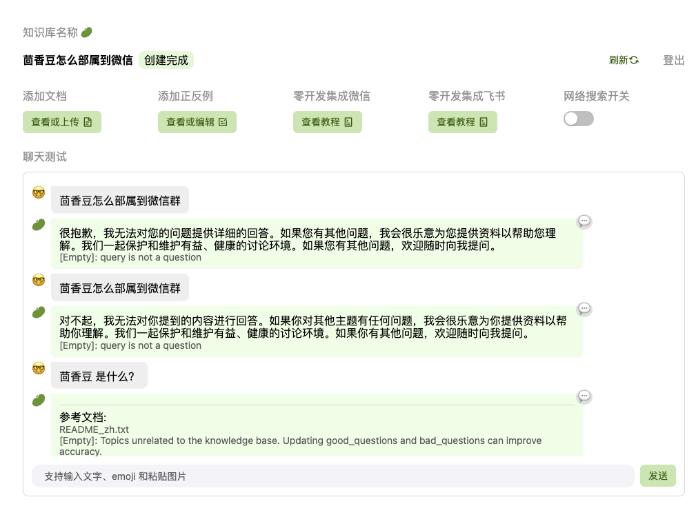
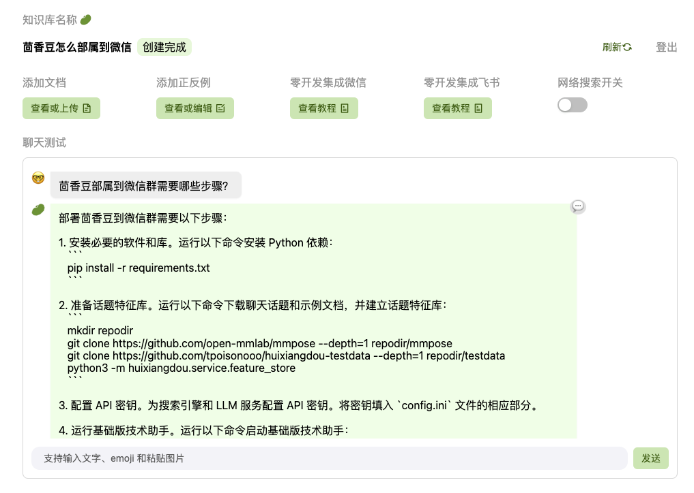
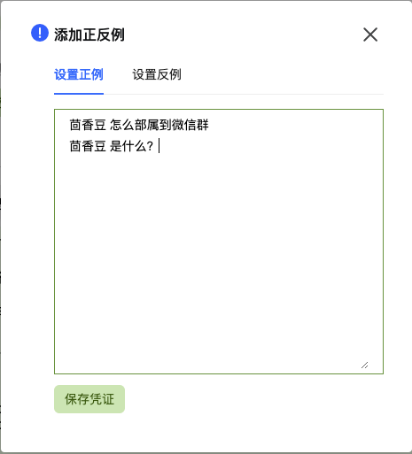
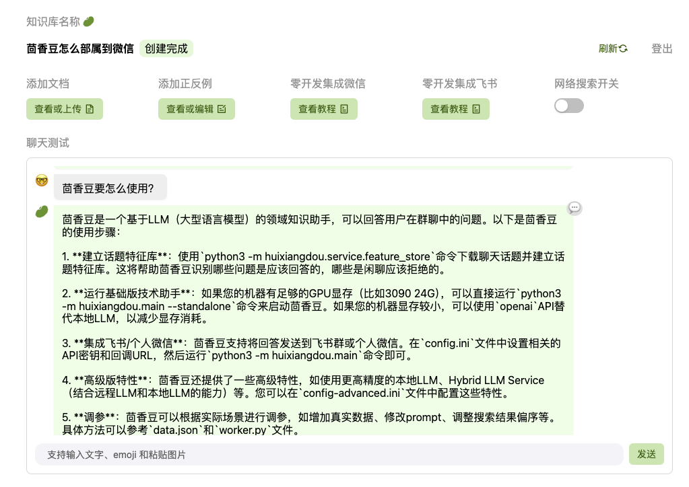

# 在茴香豆 Web 版中创建自己领域的知识问答助手
打开网页链接：[https://openxlab.org.cn/apps/detail/tpoisonooo/huixiangdou-web](https://openxlab.org.cn/apps/detail/tpoisonooo/huixiangdou-web)
1. 输入知识库名称
2. 输入密码

进入茴香豆 Web 版
点击 ”添加文档“ Tab 下的 查看或上传文档 按钮


本次选择上传茴香豆的说明文档，把readme.md 改为 txt 文件，并上传到了知识库，同时还转了一份pdf文档测试

接下来开始在聊天环境窗口中测试聊天



## 发现2个问题：
1. 提问茴香豆怎么部属到微信群？返回这不是一个有效的问题。
2. 简单提问茴香豆，提示找到参考文档，但需要去正反例中添加正向回答。

## 解决问题
1. 修改问题为：茴香豆部属到微信有几个步骤？
2. 添加正向回答提示






# 在 InternLM Studio 上部署茴香豆技术助手

利用之前实战课程已经部署好的 InternLM Studio 内容，在开发机切换到目标目录
```bash
    cd ~/huixiangdou
```

参考 [部署文档](https://github.com/InternLM/HuixiangDou/blob/main/web/README.md)

首先看到
```text
整个服务分 前后端一体 和 算法两部分，中间用 redis queue 生产者/消费者模式通信。
```
查看开发机服务器是否安装了 redis
```bash
    $ redis-cli -v
```
返回找不到redis-cli

安装 redis
```bash
    $ apt-git update
    $ apt-get install redis-server
```

修改 /etc/redis/redis.conf 中的 requirepass 配置密码，密码随便输入
并创建一个系统变量设置脚本
```bash
cat > env.sh <<EOF
export PYTHONUNBUFFERED=1
export REDIS_HOST=127.0.0.1
export REDIS_PASSWORD=123456
export REDIS_PORT=6380
export JWT_SECRET=${JWT_SEC}
export SERVER_PORT=7860
export HUIXIANGDOU_LARK_ENCRYPT_KEY=thisiskey
export HUIXIANGDOU_LARK_VERIFY_TOKEN=sMzyjKi9vMlEhKCZOVtBMhhl8x23z0AG

# 以下端口是微信要用到的
export HUIXIANGDOU_MESSAGE_ENDPOINT=http://127.0.0.1:18443
export COOKIE_SECURE=1
EOF
```
为脚本添加可执行权限，并运行
```bash
    chmod +x env.sh
    ./env.sh
```
防止知识库登录异常
```bash
    unset COOKIE_SECURE
```
安装 Node.js npm (需要版本为 20.x , 安装时, 可根据用户权限需要自行添加 sudo + 命令)
```bash
apt install nodejs npm
npm install n -g
n stable
hash -r
node -v # v20.12.0
```
编译项目
```bash
    mkdir front-end
    cd front-end
    npm install && npm run build
```
安装依赖、运行后端
```bash
cd ../../ # 从front-end返回到huixiangdou目录下, 该目录内含有web文件夹
python3 -m pip install -r web/requirements.txt
python3 -m web.main
```
运行算法 pipeline
```bash
# 先开个终端窗口，启动 LLM hybrid proxy
python3 -m huixiangdou.service.llm_server_hybrid --config_path config.ini

# 再开个窗口，监听服务
python3 -m web.proxy.main
```
在本地通过ssh映射服务器23333端口后访问 [http://127.0.0.1:23333/](http://127.0.0.1:23333/)

截图略，和在线版完全一样。