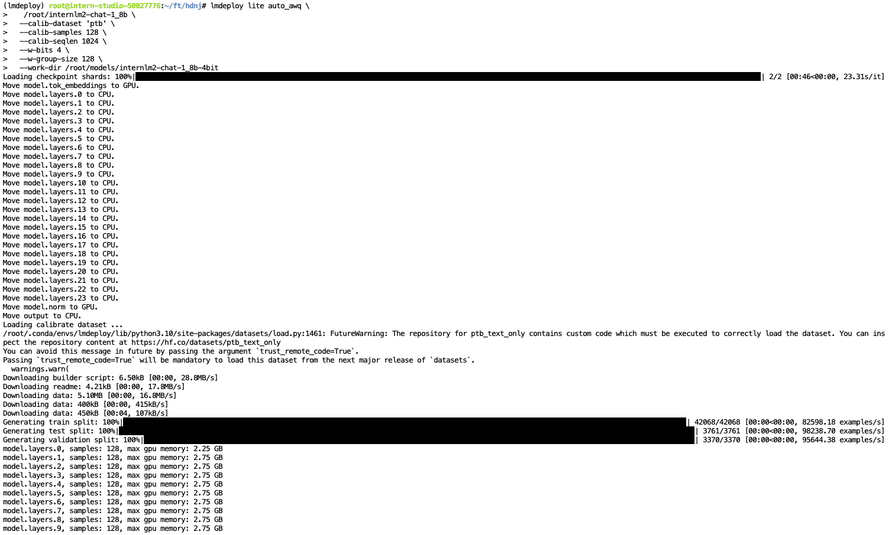
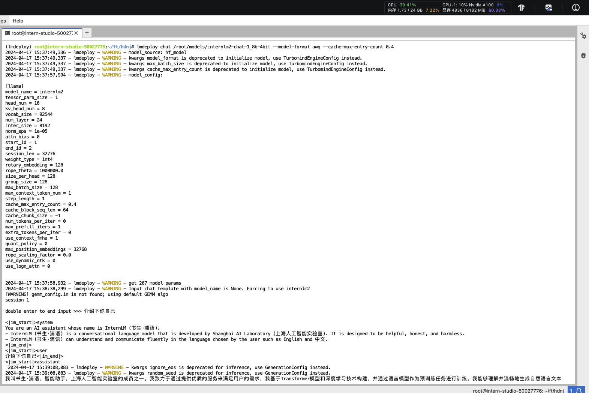
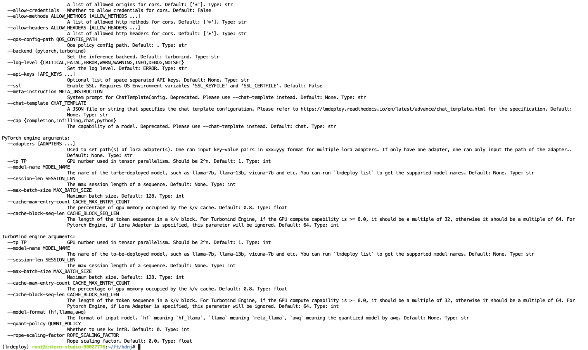
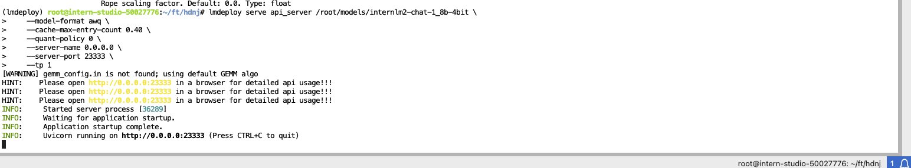
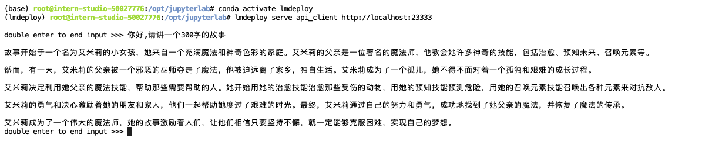
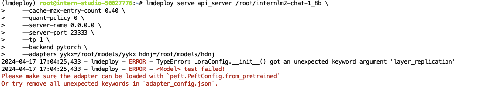
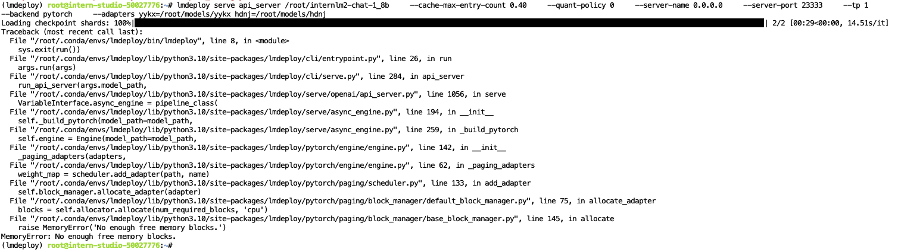
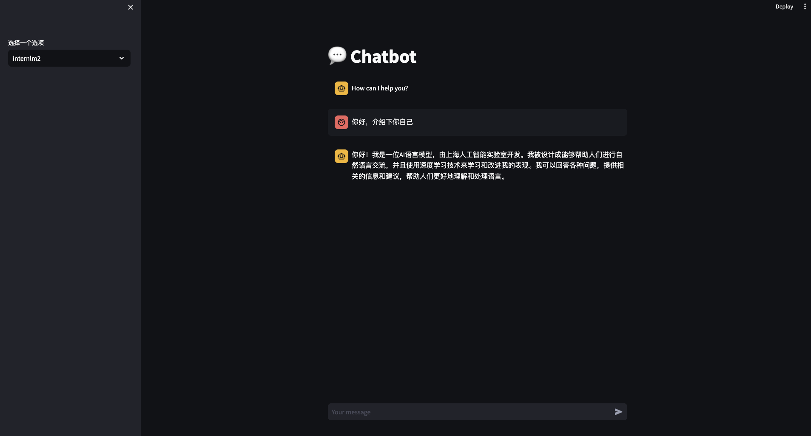

# LMDeploy部署LLM实战

## 开发机配置
由于LMDeploy是基于CUDA12开发的，所以环境配置需要注意选择CUDA12。
选择配置过程略。。。

## 配置环境
InternStudio上提供了快速创建conda环境的方法。打开命令行终端，创建一个名为lmdeploy的环境：
```shall
studio-conda -t lmdeploy -o pytorch-2.1.2
```
激活环境
```shall
conda activate lmdeploy
```

安装LMDeploy0.3.0
```shall
pip install lmdeploy[all]==0.3.0
```

## 下载模型并测试
从share目录建立一个软连接
```shall
ln -s /root/share/new_models/Shanghai_AI_Laboratory/internlm2-chat-1_8b /root/
```

测试
```shall
lmdeploy chat /root/internlm2-chat-1_8b
```
速度要比直接使用Transformer快很多

## LMDeploy模型量化(lite)
使用KV Cache设置缓存大小
```shall
lmdeploy chat /root/internlm2-chat-1_8b --cache-max-entry-count 0.5
```
默认是0.8，设置0.5后，显存占用明显小了一些

## 使用W4A16量化
安装依赖库
```shall
pip install einops==0.7.0
```

执行模型量化
```shall
lmdeploy lite auto_awq \
   /root/internlm2-chat-1_8b \
  --calib-dataset 'ptb' \
  --calib-samples 128 \
  --calib-seqlen 1024 \
  --w-bits 4 \
  --w-group-size 128 \
  --work-dir /root/internlm2-chat-1_8b-4bit
```

经过一段时间的等待，量化完成

## 测试量化后的模型效果
设置KV Cache最大占用比例为0.4，开启W4A16量化，以命令行方式与模型对话
```shall
lmdeploy chat /root/models/internlm2-chat-1_8b-4bit --model-format awq --cache-max-entry-count 0.4
```


## 启动API服务器,使用量化后的模型，且调整KV Cache为40%
先查看server的使用方式
```shall
lmdeploy serve api_server --help
```

由帮助信息得知，需要设置模型格式 --model-format awq，--cache-max-entry-count 0.40

```shall
lmdeploy serve api_server /root/models/internlm2-chat-1_8b-4bit \
    --model-format awq \
    --cache-max-entry-count 0.40 \
    --quant-policy 0 \
    --server-name 0.0.0.0 \
    --server-port 23333 \
    --tp 1
```


## 测试API服务器
命令行方式
```shall
lmdeploy serve api_client http://localhost:23333
```


## 上强度！API方式启动，并附加2个Lora
先测试无量化的版本，由于需要加入两个Lora，设置KV cache为0.4
使用上一课中微调的两个Lora，单个Lora不需要设置名称，多个需要用x=y的方式来填写
```shall
lmdeploy serve api_server /root/internlm2-chat-1_8b \
    --cache-max-entry-count 0.40 \
    --quant-policy 0 \
    --server-name 0.0.0.0 \
    --server-port 23333 \
    --tp 1 \
    --backend pytorch \ 
    --adapters yykx=/root/models/yykx hdnj=/root/models/hdnj
```

报错，提示Lora配置文件中有无法识别的参数 layer_replication，进入Lora文件夹后，在adapter_config.json中删除相应的参数后，再次启动


adapters 验证成功，但是由于是pytorch的方式启动，爆内存了，关机升级配置后依旧提示内存不够

后换了vllm部署，并附加Lora后，得到清晰的提示：目前internlm模型不支持附加lora的功能。

## 本地部署，使用streamlit web ui 方式测试
```python
import streamlit as st
from openai import OpenAI

with st.sidebar:
    model_name = st.sidebar.selectbox(
        '选择一个选项',
        ('internlm2', 'yykx', 'hdnj') #原来是用于切换Lora的，现在也没法用了，留作以后功能完善后再测试
    )

st.title("💬 Chatbot")

if "messages" not in st.session_state:
    st.session_state["messages"] = [{"role": "assistant", "content": "How can I help you?"}]

for msg in st.session_state.messages:
    st.chat_message(msg["role"]).write(msg["content"])

if prompt := st.chat_input():
    #client = OpenAI(api_key='internlm2-chat-1_8b')
    client = OpenAI(
        api_key='YOUR_API_KEY',
        base_url="http://0.0.0.0:23333/v1"
    )
    st.session_state.messages.append({"role": "user", "content": prompt})
    st.chat_message("user").write(prompt)
    response = client.chat.completions.create(
        model=model_name,
        messages=st.session_state.messages)
    msg = response.choices[0].message.content
    st.session_state.messages.append({"role": "assistant", "content": msg})
    st.chat_message("assistant").write(msg)
```
保存为 app.py
## 启动streamlit
打通SSH
```shall
ssh -CNg -L 23333:127.0.0.1:23333 root@ssh.intern-ai.org.cn -p <你的ssh端口号>
```
启动App
```shall
streamlit run app.py
```

原模型测试通过