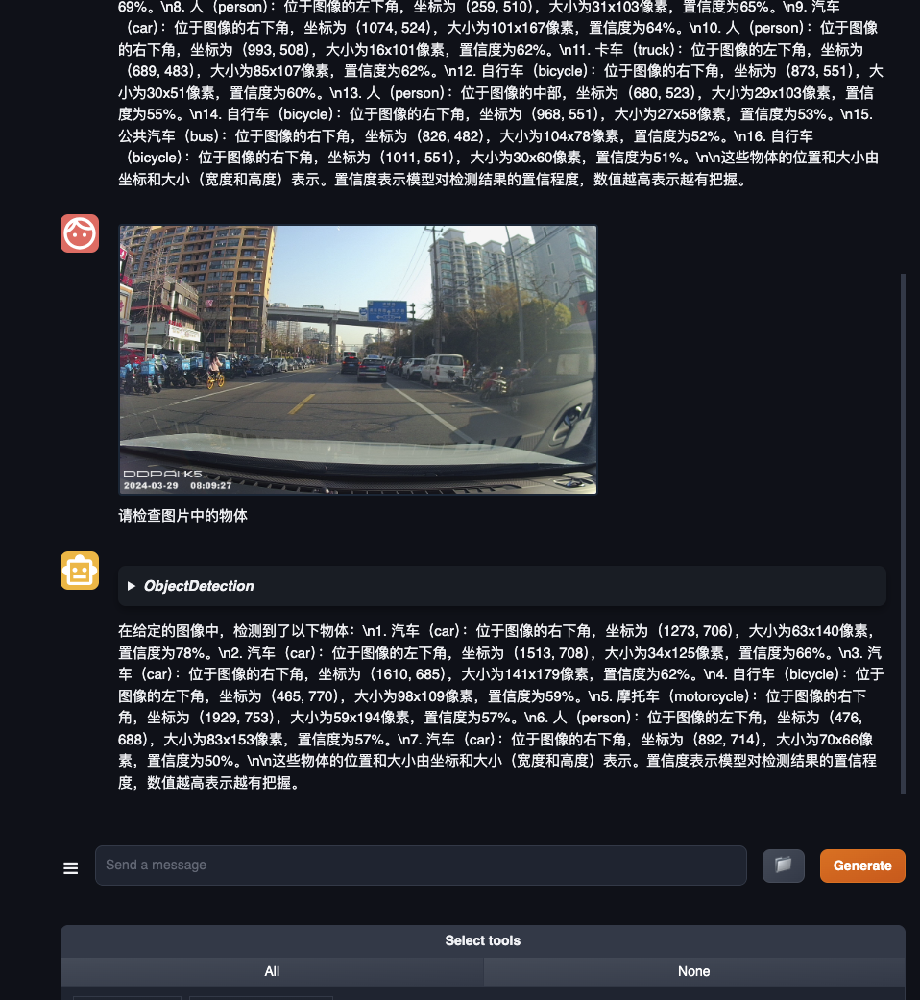
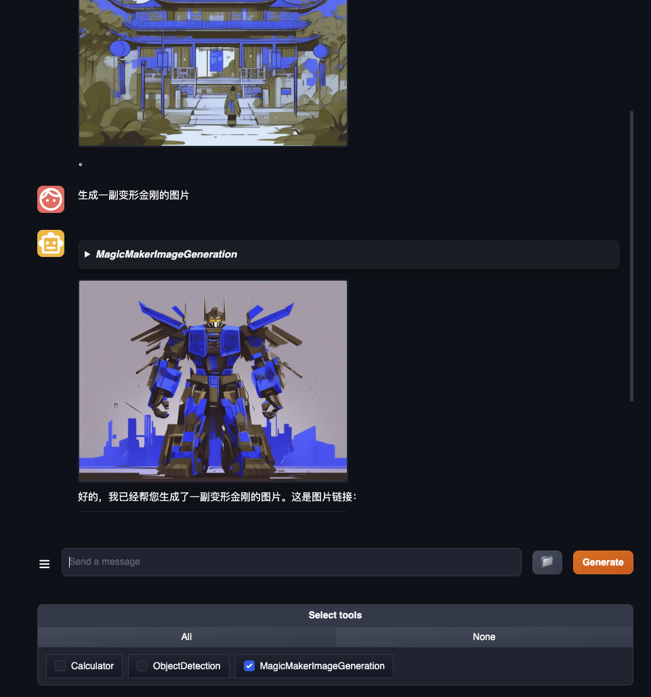

# 第六课笔记和作业

前期环境安装略。。。

## Lagent：轻量级智能体框架

使用lmdeploy部属7B模型，并以api方式启动
```shall
conda activate agent
lmdeploy serve api_server /root/share/new_models/Shanghai_AI_Laboratory/internlm2-chat-7b \
                            --server-name 127.0.0.1 \
                            --model-name internlm2-chat-7b \
                            --cache-max-entry-count 0.1
```


启动并使用 Lagent Web Demo
```shall
cd /root/agent/lagent/examples
streamlit run internlm2_agent_web_demo.py --server.address 127.0.0.1 --server.port 7860
```


开启本地浏览器并搜索interlm2的论文

再次搜索关于Qwen的论文


## 用 Lagent 自定义工具

发现对于要使用工具，所提问的方式很重要，必须要显式的提出查询天气才会触发工具调用，如果是问天气怎么样，LLM并不会调用工具，而是提出要告诉他查询API。

## AgentLego：组装智能体“乐高”

直接使用 AgentLego，代码略。。。


AgentLego WebUI


用 AgentLego 自定义工具
